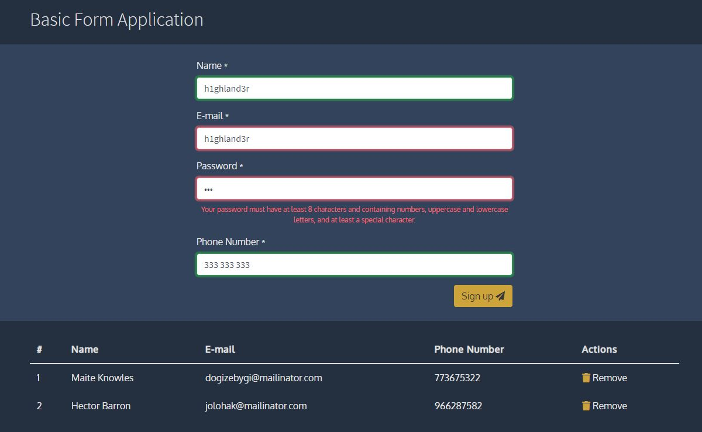
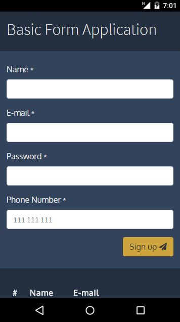

# Basic Form Application
 
Personal project for training Node.Js and MongoDB integration
  

**Developed using**
 
Frontend: HTML5, EJS, Boostrap, FontAwesome, jQuery
 
Backend: Node.Js, Express, MongoDB, Mongoose
  

**Instructions for testing**
 
1) Clone the project;
2) Run npm install;
3) Install MongoDB and start its service;
4) Run npm start.

  

**UI**

  

  

